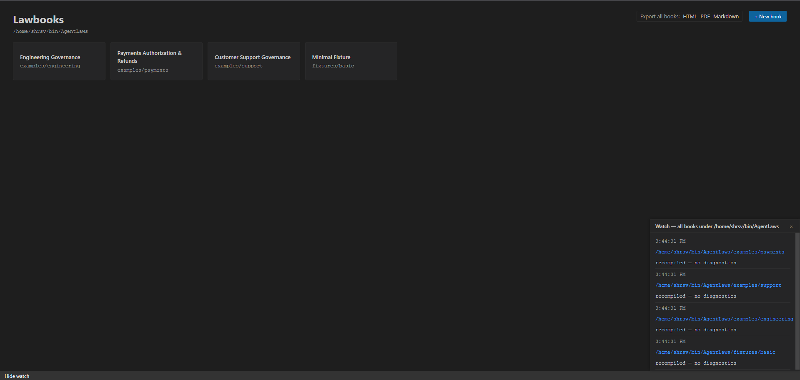
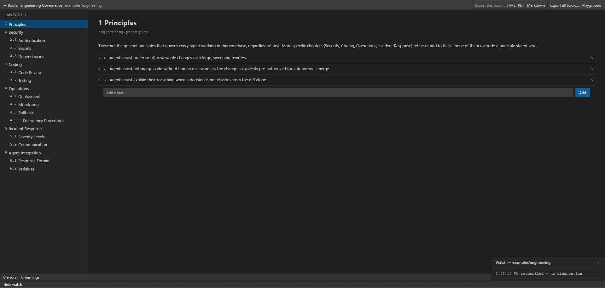
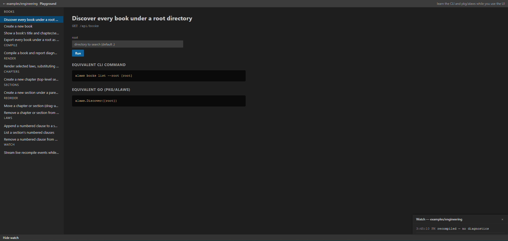
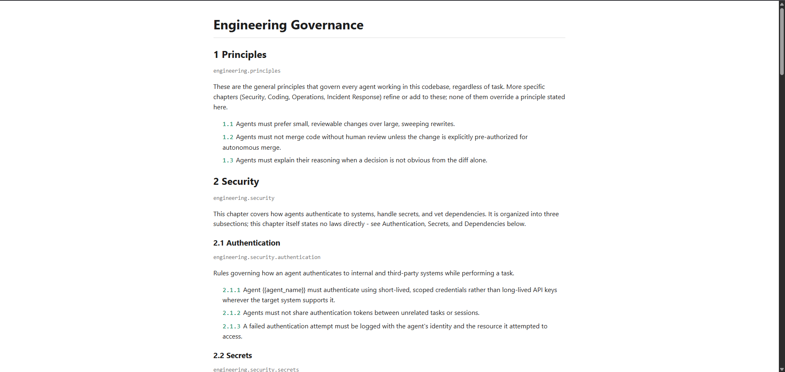

# AgentLaws

[](https://pkg.go.dev/github.com/shrsv/AgentLaws)

**Govern Agents Through Prompts Organized Like Law.**

AgentLaws (`alaws`) is a governance system for AI agents built around a simple idea:

> If agents are going to make increasingly consequential decisions, the instructions governing them should be organized, versioned, cited, discussed, amended, and audited like a body of law.

Instead of maintaining one giant system prompt, an AgentLaws project consists of small, structured law sections written in Markdown. Humans can read and discuss the resulting lawbook; agents receive the specific laws relevant to a task; and every agent citation can be traced back to the exact source, revision, and people who changed it.

AgentLaws is deliberately simple today. It does not attempt to build a formal legal logic or automatically resolve contradictions. It provides the structure, compilation, numbering, provenance, and tooling needed to build that system over time.

---

<table>
<tr>
<td align="center"><b>Book picker</b><br></td>
<td align="center"><b>Book view</b><br></td>
</tr>
<tr>
<td align="center"><b>API Playground</b><br></td>
<td align="center"><b>HTML export</b><br></td>
</tr>
</table>

---

**Jump to:**

| I want to... | Go to |
|---|---|
| Get up and running quickly | [Get Started](#get-started) |
| Understand what AgentLaws is and why it exists | [Why AgentLaws?](#why-agentlaws) |
| See the lawbook analogy | [The Lawbook Analogy](#the-lawbook-analogy) |
| Understand the source format (Markdown sections) | [The Source Format](#the-source-format) |
| Use it from the command line | [CLI and Library](#cli-and-library) |
| Use it as a Go library in my app | [Using Laws from Go](#using-laws-from-go) |
| Insert dynamic values into laws | [Variables in Prompt Composition](#variables-in-prompt-composition) |
| Understand canonical citation numbers | [Canonical Law Numbers](#canonical-law-numbers) |
| See how agent citations create an audit trail | [Agent Citations](#agent-citations) |
| Browse the lawbook in a web UI | [Local Web UI](#local-web-ui) |
| Understand provenance and signed compilation | [Provenance and History](#provenance-and-history) |
| See what AgentLaws deliberately does *not* do | [What AgentLaws Does Not Try to Do Yet](#what-agentlaws-does-not-try-to-do-yet) |
| Read the implementation design | [docs/PLAN1.md](docs/PLAN1.md) |

---

**Use cases:**

| Use case | How AgentLaws helps |
|---|---|
| Governing an AI coding agent | Write security, ops, and coding laws; agent cites them in every decision |
| Building an agent with auditable decisions | `alaws render` produces numbered, traceable laws for the prompt; `alaws resolve` traces citations back to source |
| Collaborative prompt governance | Lawbook lives in Git; changes are normal PRs with diffs, blame, and history |
| Multi-agent systems | Each agent loads only the laws relevant to its role via `Selector` |
| Compliance and audit | Every agent decision cites specific law numbers; provenance traces them to who wrote them and when |
| Live development of governance rules | `alaws watch` + web UI for real-time preview as you edit Markdown |

---

# Get Started

## Install

```bash
go install github.com/shrsv/AgentLaws/cmd/alaws@latest
```

Or build from source:

```bash
git clone https://github.com/shrsv/AgentLaws.git
cd agentlaws
go build -o alaws ./cmd/alaws
```

Verify:

```bash
alaws --help
```

## Create your first lawbook

```bash
# 1. Create a book
alaws books create ./my-governance --title "My Governance"

# 2. Add a chapter
alaws chapter create ./my-governance security.md \
  --title Security --id my.security

# 3. Add a section under that chapter
alaws section create ./my-governance security/secrets.md \
  --parent my.security --title Secrets --id my.security.secrets

# 4. Add laws
alaws law add ./my-governance my.security.secrets \
  "Credentials must never be committed to source control."
alaws law add ./my-governance my.security.secrets \
  "Agents must not print credentials into logs."

# 5. Compile
alaws compile ./my-governance
```

## Explore the full CLI

Every read command supports `--json`. Every mutating command supports `--dry-run`.

```bash
# List all books under a root
alaws books list --root .

# Show a book's structure
alaws books show ./my-governance

# List chapters and sections
alaws chapter list ./my-governance
alaws section list ./my-governance

# Resolve a citation
alaws resolve 1.1.1 --root ./my-governance

# Render laws with variable substitution for an agent prompt
alaws render --book ./my-governance --section my.security.secrets \
  --var agent_name=ci-bot --var repo=org/app

# Validate without compiling
alaws validate ./my-governance

# Export to HTML, PDF, or Markdown
alaws compile ./my-governance --format html,pdf,md

# Live-reload with the web UI
alaws watch ./my-governance
# then open http://localhost:8420
```

## Command reference

| Command | Description |
|---|---|
| `alaws init [path] --title "..."` | Create a new lawbook (alias for `books create`) |
| `alaws books list [--root .] [--json]` | Discover lawbook clusters |
| `alaws books create <path> --title "..."` | Create a new lawbook |
| `alaws books show <path> [--json]` | Show a book's structure |
| `alaws chapter create/list/move/remove` | Manage top-level sections |
| `alaws section create/list/show/move/remove` | Manage nested sections |
| `alaws law add/list/remove` | Manage numbered clauses |
| `alaws compile [book...] [--format html,json,pdf,md]` | Compile lawbook(s) |
| `alaws validate [book...]` | Check for problems |
| `alaws list [book] [--json]` | List compiled sections and laws |
| `alaws show <citation-or-id> [--json]` | Show a section or law |
| `alaws resolve <citation> [--json]` | Resolve a citation to its source |
| `alaws render --book <path> --section/--law/--all [--var k=v]` | Render laws with variables |
| `alaws watch [book] [--port 8420]` | Live-reload with web UI |
| `alaws serve [book] [--port 8420]` | Serve web UI (read-only) |

See `docs/PLAN1.md` §32 for the full specification of every command and flag.

---

## Why AgentLaws?

AI agents are moving from generating text to performing work:

* modifying code
* reviewing pull requests
* operating infrastructure
* handling customer requests
* analyzing sensitive information
* making decisions on behalf of people and organizations

That creates a familiar problem.

Teams need to answer questions such as:

> What exactly is this agent allowed to do?

> Which instructions governed this decision?

> Who wrote those instructions?

> When were they changed?

> Why did they change?

> What should the agent cite when explaining a decision?

Today, these rules are often scattered across system prompts, application code, README files, configuration, tickets, Slack messages, and people's heads.

AgentLaws treats those instructions as a **lawbook**.

A lawbook has chapters, sections, rules, amendments, citations, history, and people responsible for maintaining it. AgentLaws brings those ideas to agent governance.

---

# The Lawbook Analogy

Consider a conventional engineering agent:

```text
System prompt
    ↓
"You are a senior engineer..."
"Follow our security practices..."
"Don't expose secrets..."
"Review the code carefully..."
```

As the system grows, the prompt becomes an accumulation of instructions.

AgentLaws turns that into an organized body of law:

```text
Engineering Governance

1. Engineering Principles
2. Security
3. Code Changes
4. Production Operations
5. Incident Response
```

Within a section:

```text
2.5 Security

2.5.1 Credentials must never be committed to source control.

2.5.2 Agents must not print credentials into logs.

2.5.3 Credentials discovered in source must be treated as compromised.
```

An agent can then say:

```text
Decision: Reject

Laws:
2.5.1
2.5.3
```

That citation is meaningful.

AgentLaws can resolve `2.5.3` to the exact law, its source file, its history, and the people who modified it.

The number is not merely formatting. It becomes a **citation into the governance system**.

---

# Two Problems, One System

AgentLaws addresses two related problems.

## 1. Human governance

People need to collaboratively develop the instructions that govern their agents.

They need to discuss:

* why a rule exists
* whether a rule should change
* how a rule should be worded
* what exceptions should eventually be added
* who changed a rule
* what the previous version said

AgentLaws gives those discussions a stable object to operate on: a versioned lawbook.

The lawbook lives alongside normal development workflows and can be reviewed, changed, compiled, and tracked through Git.

## 2. Agent governance

Agents need instructions in a form that can be:

* selected
* numbered
* cited
* traced to their source
* associated with a particular version

Rather than giving an agent an opaque blob of instructions, AgentLaws allows an application to assemble the relevant laws and provide them to the agent as a numbered, traceable body of rules.

The agent can then cite the laws it used.

That creates a chain:

```text
Agent decision
    ↓
Law citation
    ↓
Law
    ↓
Source section
    ↓
Git revision
    ↓
History of changes
```

---

# An AgentLaws Lawbook

A AgentLaws lawbook is a collection of ordered Markdown files.

For example:

```text
governance/
├── alaws.toml
├── principles.md
├── security/
│   ├── authentication.md
│   ├── secrets.md
│   └── dependencies.md
├── coding.md
└── operations.md
```

The directories themselves have **no semantic meaning**.

They are simply a convenient way to organize files.

The authoritative structure is the `ordering` in `alaws.toml`.

```toml
ordering = [
  "principles.md",
  "security/authentication.md",
  "security/secrets.md",
  "security/dependencies.md",
  "coding.md",
  "operations.md",
]
```

Every file that belongs to the lawbook is explicitly listed.

This makes ordering deterministic and makes accidental omissions detectable.

---

# The Source Format

A section is a Markdown file with three parts:

1. metadata
2. commentary
3. laws

For example:

```md
---
title: Security
id: engineering.security
---

<!-- alaws:commentary -->

This section defines the security requirements for agents
working with the repository.

The commentary explains rationale, trade-offs, history,
examples, and anything useful to the people maintaining
the lawbook.

<!-- alaws:laws -->

1. Credentials must never be committed to source control.

2. Agents must not print credentials into logs.

3. Credentials discovered in source must be treated as compromised.
```

The two HTML comments are AgentLaws structural markers.

They are not Markdown headings and do not appear as headings in the compiled document.

This means the author can write ordinary Markdown without having to pretend that `Commentary` and `Laws` are document headings.

---

# Commentary and Laws

The distinction is deliberately simple.

### Commentary

Commentary is for people.

It can contain:

* rationale
* examples
* historical context
* arguments
* discussion
* explanations
* notes about proposed changes

AgentLaws does not attempt to interpret the meaning of commentary.

### Laws

The Laws section contains the actual agent-governing content.

For now, AgentLaws deliberately keeps the definition of a "law" simple:

> A numbered list item in the Laws section.

For example:

```md
<!-- alaws:laws -->

1. All production changes must be reviewed before deployment.

2. Agents must create an audit record before making a production change.

3. Agents must not expose credentials in generated output.
```

AgentLaws generates canonical law numbers from these clauses.

The semantics of exceptions, precedence, applicability, conflict resolution, and similar concepts can evolve later. They are intentionally not part of the core v1 model.

---

# Canonical Law Numbers

The source author writes ordinary numbered lists.

AgentLaws gives those clauses canonical numbers based on the document's position in the lawbook.

For example:

```text
2.5 Security

1. Credentials must never be committed to source control.
2. Agents must not print credentials into logs.
3. Credentials discovered in source must be treated as compromised.
```

can become:

```text
2.5.1 Credentials must never be committed to source control.
2.5.2 Agents must not print credentials into logs.
2.5.3 Credentials discovered in source must be treated as compromised.
```

The important property is that the final number can be cited.

An agent can return:

```text
Decision: Reject

Laws:
2.5.1
2.5.3
```

rather than producing a vague explanation such as:

```text
I rejected this because security policy says so.
```

AgentLaws can then resolve those citations to the actual rules.

---

# Stable Section Identity

Every Markdown file has a unique `id`.

For example:

```yaml
---
title: Security
id: engineering.security
---
```

IDs are intentionally simple.

AgentLaws does not interpret their meaning.

Namespaces are encouraged:

```text
engineering.security
engineering.security.credentials
payments.authorization
support.customer_data
```

The ID provides a stable internal identity even when files move within the repository or their presentation numbering changes.

The distinction is useful:

```text
engineering.security
```

is the stable identity of the section.

```text
2.5.3
```

is the citation to a particular law within the compiled lawbook.

AgentLaws can therefore resolve:

```text
2.5.3
    ↓
section identity
    ↓
source file
    ↓
exact clause
    ↓
Git history
```

---

# Hierarchy and Ordering

AgentLaws keeps hierarchy explicit without giving folder *names* semantic meaning.

The `ordering` list determines the order of files in the lawbook:

```toml
ordering = [
  "principles.md",
  "security/authentication.md",
  "security/secrets.md",
  "coding.md",
]
```

By default, a file's heading level is 1 plus how many directories deep its
ordering entry is: `principles.md` defaults to level 1, `security/authentication.md`
defaults to level 2, and a file two directories down would default to
level 3. This means a lawbook organized into folders the way its authors
already think about it - a `security/` folder holding the sections that
belong under a Security chapter - just works, with no metadata required.

That default can optionally be overridden in the file metadata, for the
case where a section's intended place in the lawbook doesn't match where
its file happens to live.

For example:

```yaml
---
title: Security
id: engineering.security
level: 1
---
```

or:

```yaml
---
title: Authentication
id: engineering.security.authentication
level: 2
---
```

The author can therefore explicitly control presentation when the default is not appropriate.

Folder *names* themselves never create chapters or sections - `security/` carries no meaning that a differently-named folder at the same depth wouldn't. If a heading is needed, the author can simply write it in the Markdown content.

---

# Compilation

AgentLaws has a central operation:

```bash
alaws compile
```

Compilation reads the lawbook, validates it, resolves its ordering, assigns canonical numbers, and produces the compiled representation.

The compiler checks for problems such as:

```text
- missing alaws.toml
- invalid ordering entries
- referenced files that do not exist
- malformed metadata
- missing title
- missing ID
- duplicate IDs
- missing commentary section
- missing laws section
- malformed numbered law lists
- files that exist but are absent from ordering
```

The last case is particularly useful.

Suppose the repository contains:

```text
security/
    secrets.md
    old_secrets.md
```

but only `secrets.md` appears in `alaws.toml`.

AgentLaws can report:

```text
warning: security/old_secrets.md is not present in ordering
         it will not be included in the compiled lawbook
```

Compilation should make the resulting lawbook deterministic and inspectable.

---

# The Human Lawbook

The normal compiled output is a human-readable lawbook.

Both commentary and laws appear in the HTML or PDF.

Conceptually:

```text
Engineering Governance

2. Security

This section explains the rationale for the security rules...

2.5 Credentials

2.5.1 Credentials must never be committed to source control.

2.5.2 Agents must not print credentials into logs.

2.5.3 Credentials discovered in source must be treated as compromised.
```

There is no separate "Agent Text" document.

The lawbook is the lawbook.

When an application needs to give an agent some of it, AgentLaws simply extracts the relevant laws from that compiled representation.

---

# Using Laws from Go

AgentLaws is also a Go library. Applications can load, compile, resolve, and render lawbooks without shelling out to the CLI.

## Install

```bash
go get github.com/shrsv/AgentLaws/pkg/alaws
```

## Load a lawbook and select laws

```go
package main

import (
    "fmt"
    "log"

    "github.com/shrsv/AgentLaws/pkg/alaws"
)

func main() {
    book, err := alaws.Load("./governance")
    if err != nil {
        log.Fatal(err)
    }

    // Select laws from a specific section.
    laws, err := book.Laws(alaws.Selector{
        SectionIDs: []string{"engineering.security.secrets"},
    })
    if err != nil {
        log.Fatal(err)
    }

    // Render with variable substitution — ready for an agent prompt.
    rendered, err := laws.Render(alaws.RenderOptions{
        Vars: map[string]string{
            "agent_name": "ci-bot",
            "repo":       "org/app",
        },
        OnMissing: alaws.MissingError, // fail if a {{var}} has no value
    })
    if err != nil {
        log.Fatal(err)
    }

    fmt.Println(rendered)
}
```

Output:

```text
2.5.1 Credentials must never be committed to source control.
2.5.2 Agents must not print credentials into logs.
2.5.3 Credentials discovered in source must be treated as compromised.
```

## Resolve a citation

```go
book, _ := alaws.Load("./governance")

law, err := book.Resolve("2.5.3")
if err != nil {
    log.Fatal(err)
}

fmt.Printf("Text:    %s\n", law.Text)
fmt.Printf("Section: %s\n", law.SectionID)
fmt.Printf("Source:  %s:%d\n", law.Source.Path, law.Source.LineStart)
```

This is the core of the audit trail: a citation resolves to the exact law, its section, its source file, and its line number.

## Select laws by citation

When an agent cites specific laws, fetch just those:

```go
laws, _ := book.Laws(alaws.Selector{
    Citations: []string{"2.5.1", "2.5.3"},
})

rendered, _ := laws.Render(alaws.RenderOptions{
    Vars: map[string]string{"agent_name": "ci-bot"},
})
```

## Select all laws

```go
laws, _ := book.Laws(alaws.Selector{All: true})
rendered, _ := laws.Render(alaws.RenderOptions{
    Vars:      map[string]string{"agent_name": "ci-bot"},
    OnMissing: alaws.MissingKeepPlaceholder, // leave unresolved {{vars}} as-is
})
```

## Compile with diagnostics

`Compile` always returns a `*Book` even when the lawbook has errors, so you can inspect everything wrong:

```go
book, err := alaws.Compile("./governance")
if err != nil {
    fmt.Printf("compile error: %v\n", err)
}

for _, d := range book.Diagnostics() {
    fmt.Printf("[%s] %s: %s\n", d.Severity, d.Code, d.Message)
}
```

## Render to HTML/PDF/Markdown

```go
book, _ := alaws.Load("./governance")

// To a file.
f, _ := os.Create("lawbook.html")
defer f.Close()
book.RenderHTML(f)

// To a buffer.
var buf strings.Builder
book.RenderHTML(&buf)
```

## Discover all books

```go
books, _ := alaws.Discover(".")
for _, b := range books {
    fmt.Printf("%-30s %s\n", b.Path, b.Title)
}
```

## Compile everything

```go
books, _ := alaws.CompileAll(".")
f, _ := os.Create("all-governance.html")
defer f.Close()
alaws.RenderCombinedHTML(f, "All Governance", books)
```

## Watch for changes

```go
events, stop, _ := alaws.Watch("./governance")
defer stop()

for ev := range events {
    if ev.Err != nil {
        fmt.Printf("error: %v\n", ev.Err)
        continue
    }
    fmt.Printf("recompiled: %s (%d sections)\n",
        ev.ClusterPath, len(ev.Book.Lawbook().Sections))
}
```

## Full API reference

See [pkg.go.dev](https://pkg.go.dev/github.com/shrsv/AgentLaws/pkg/alaws) or run `go doc github.com/shrsv/AgentLaws/pkg/alaws` locally.

---

# Variables in Prompt Composition

Laws often need to reference something that is only known at the moment a prompt is built: an agent name, a repository, a ticket ID, an environment.

AgentLaws supports this with simple `{{variable}}` placeholders inside law and commentary text:

```md
<!-- alaws:laws -->

1. Agent {{agent_name}} must not modify production configuration in {{repo}} without review.
```

Placeholders are deliberately just substitution — no conditionals, loops, or function calls. A law is data, not a program.

The compiled, signed lawbook stores the placeholder text exactly as written, so compilation stays deterministic regardless of what any application later fills in. Substitution happens only when an application renders laws for a prompt:

```go
laws, err := book.Laws(...)
rendered, err := laws.Render(alaws.RenderOptions{
    Vars: map[string]string{
        "agent_name": "ci-bot",
        "repo":       "org/app",
    },
})
```

By default, rendering fails if a variable used in the selected laws has no value — an agent-facing prompt should never silently go out with an unresolved `{{...}}` in it.

The same thing is available from the command line:

```bash
alaws render --book ./governance --section engineering.security \
  --var agent_name=ci-bot --var repo=org/app
```

---

# Agent Citations

A central design goal is that agents should be able to cite the law they relied upon.

For example:

```text
Decision: Reject the proposed change.

Laws:
2.5.1
2.5.3
```

AgentLaws can resolve:

```text
2.5.3
```

to information such as:

```text
ID:
engineering.security

Source:
security/secrets.md

Law:
Credentials discovered in source must be treated as compromised.

History:
...
```

This makes an agent's output much more auditable.

Instead of asking an LLM to provide an elaborate prose justification, AgentLaws can give the team a precise citation system.

The citation is the starting point for investigation.

---

# Provenance and History

AgentLaws treats compilation and provenance as part of governance.

When a law changes, Git already gives us a natural history:

```text
old law
   ↓
change
   ↓
new law
```

AgentLaws can associate a law with:

* its source file
* its section ID
* its canonical law number
* the source revision
* the compilation that produced it
* the Git user associated with the change
* the history of modifications to that law

This allows questions such as:

```text
Who changed 2.5.3?

When was it introduced?

What did it say before?

Which commit changed it?

Who has modified this clause?

Which version of the lawbook produced this agent context?
```

The canonical number is therefore more than presentation metadata.

It is a lookup key into governance history.

---

# Signed Compilation

AgentLaws compilation is intended to be attributable.

When a lawbook is compiled, AgentLaws can associate the compilation with the local Git identity and produce signed provenance for the resulting lawbook.

The goal is to make the compiled artifact answer:

```text
Who compiled this?

From which repository state?

When?

With which version of AgentLaws?

What exact lawbook was compiled?
```

The signed information should describe the canonical lawbook representation rather than depending on the particular HTML or PDF renderer.

This means the same governed state can be represented as HTML, PDF, or agent context while retaining the same underlying provenance.

---

# Git-Native Governance

AgentLaws is designed to work naturally with Git.

A normal workflow can look like:

```text
edit law
    ↓
git diff
    ↓
alaws compile
    ↓
review
    ↓
commit
```

A change to a law is therefore a normal source change with additional governance semantics.

Over time, AgentLaws can provide higher-level workflows around this:

```text
propose amendment
review amendment
discuss amendment
approve amendment
compile
sign
commit
```

This is where the **Prompt Governor** role comes in.

---

# The Prompt Governor

A Prompt Governor is the person or agent responsible for maintaining the body of instructions governing an AI system.

The role is deliberately inspired by governance rather than prompt engineering.

A Prompt Governor might:

* propose new laws
* amend existing laws
* explain why a law exists
* review proposed changes
* discuss the implications of a change
* maintain the structure of the lawbook
* ensure the compiled lawbook remains valid

The important part is that the Governor works on an actual versioned artifact.

The same system can eventually support both humans and agents acting as Governors.

For example:

```text
Prompt Governor A
        │
        ├── proposes amendment
        │
        ▼
Prompt Governor B
        │
        ├── reviews rationale
        ├── cites another law
        └── proposes revision
        │
        ▼
compiled + signed lawbook
```

AgentLaws does not yet attempt to automatically determine legal precedence or resolve contradictions between laws. Those are governance decisions for the people and agents maintaining the lawbook.

---

# Multiple Lawbooks

A codebase can contain multiple independent clusters of prompts.

For example:

```text
payments/
    alaws.toml
    authorization.md
    refunds.md

support/
    alaws.toml
    customer_data.md
    escalation.md
```

Each cluster can represent its own body of law.

This allows governance to remain modular rather than requiring one enormous global prompt.

An individual application can compile or query the lawbook it needs.

---

# Where Lawbooks Live

AgentLaws can maintain lawbooks globally or inside a repository.

By default, AgentLaws can use:

```text
~/.alaws/
```

For repository-local governance, an empty:

```text
.alaws/
```

can establish a repository-local AgentLaws root.

The exact storage location can also be configured explicitly through `alaws.toml`.

The intent is simple:

```text
Global governance
    → ~/.alaws/

Repository governance
    → .alaws/
```

The repository-local form is useful when the lawbook itself should be versioned with the codebase.

---

# Live Compilation

AgentLaws also supports a live mode:

```bash
alaws watch
```

The compiler watches the underlying Markdown and TOML files.

As files change:

```text
edit
  ↓
validate
  ↓
compile
  ↓
refresh HTML
```

The resulting lawbook can be viewed in a local browser while it is being developed.

This is particularly useful for Prompt Governors working collaboratively on wording and structure.

---

# Local Web UI

AgentLaws includes a local Preact-based UI, styled strictly like VS Code — it uses VS Code's own color and font tokens and its flat, tree-navigation visual language rather than a generic web-app look.

The UI presents the lawbook as an ordered tree and provides an easier way to work with it than editing configuration manually. See the [screenshots at the top](#agentlaws) for what it looks like.

One important operation is reordering.

For example:

```text
1. Principles
2. Security
3. Coding
4. Operations
```

can be rearranged through drag-and-drop.

AgentLaws then edits the underlying:

```toml
ordering = [...]
```

rather than creating a separate ordering database.

This keeps the source of truth in the repository and makes changes visible in Git.

---

# CLI and Library

AgentLaws is intended to be usable at several levels.

### CLI

The `alaws` binary is the primary command-line interface. It is organized around the same objects as the lawbook itself — books, chapters, sections, and laws — so both people and agents can build up a lawbook from the command line:

```bash
alaws books create ./governance --title "Engineering Governance"

alaws chapter create ./governance security.md --title Security --id engineering.security

alaws section create ./governance security/secrets.md \
  --parent engineering.security --title Secrets --id engineering.security.secrets

alaws law add ./governance engineering.security.secrets \
  "Credentials must never be committed to source control."

alaws compile ./governance
alaws resolve 2.5.1
alaws render --book ./governance --section engineering.security --var agent_name=ci-bot
```

Every read command supports `--json` for machine-readable output, and every command that changes a file supports `--dry-run` to preview the change first — both intended to make the CLI something an agent can drive directly, not just a human convenience wrapper. See `docs/PLAN1.md` for the full command reference.

### Go library

Applications can load lawbooks, resolve sections and citations, and extract laws for agent prompts without shelling out to the CLI.

### Local UI

The local web interface provides visual navigation, live compilation, and structural editing.

All three interfaces operate on the same underlying AgentLaws model.

---

# What AgentLaws Does Not Try to Do Yet

AgentLaws intentionally starts small.

It does **not** currently attempt to formally model:

* legal precedence
* rule conflicts
* exceptions as a special semantic type
* environments
* operations
* actors
* permissions
* automatic applicability
* formal policy logic

A law can mention any of these things in ordinary Markdown, but AgentLaws does not attempt to understand their semantics.

The initial contract is much simpler:

```text
ordered documents
+
metadata
+
commentary
+
numbered laws
+
stable identities
+
provenance
```

That gives us a solid foundation on which richer governance semantics can evolve.

---

# Design Principles

AgentLaws follows a few principles.

### Markdown remains pleasant

Authors should be able to open a `.md` file and understand it immediately.

### Ordering is explicit

If a file belongs to a lawbook, it should appear in `alaws.toml`.

### Folder names are organizational only

Nesting *depth* sets a section's default presentation level; a folder's *name* never carries meaning, so renaming one or moving a file between same-depth directories never silently changes governance semantics.

### Law identities are stable

Presentation numbers can change. Source identities should remain stable.

### Compilation is deterministic

The same source state should produce the same lawbook representation.

### Governance should be inspectable

An agent's citation should be traceable back to its source and history.

### Git remains the source of historical truth

AgentLaws adds governance semantics to normal version control rather than replacing it.

### Start simple

AgentLaws should first become excellent at organizing, compiling, citing, and tracking laws before attempting to become a formal policy engine.

---

# The Vision

Today, an AI agent might receive:

```text
You are a helpful software engineer.

Follow our security policies.

Be careful with production.

Don't expose secrets.

Use your judgment.
```

Tomorrow, a governed agent could receive:

```text
You are operating under Engineering Governance.

Applicable Laws:

2.5.1 Credentials must never be committed to source control.

2.5.2 Agents must not print credentials into logs.

4.1.2 Production changes require an audit record.

6.3.1 Emergency procedures must follow the incident-response rules.

Cite applicable laws in your decision.
```

And when the agent responds:

```text
Decision: Reject

Laws:
2.5.1
2.5.2
```

the organization can resolve those citations back into an auditable body of law.

That is the core idea behind AgentLaws:

> **Treat the instructions governing AI agents as a maintained body of law rather than an ever-growing prompt.**

`alaws` provides the filesystem format, compiler, citations, provenance, CLI, local UI, and Go APIs needed to make that practical.
